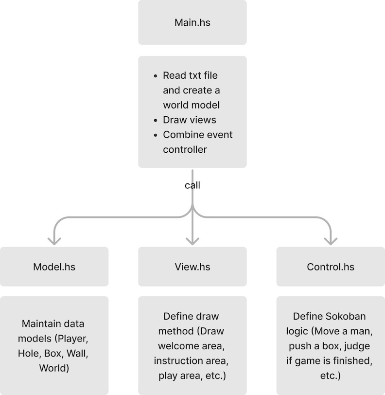

# CSE230-Haskell-Sokoban

## Project Idea

Sokoban is a puzzle video game genre in which the player pushes crates or boxes around in a warehouse, trying to get them to storage locations. 

The game is played on a board of squares, where each square is a floor or a wall. Some floor squares contain boxes, and some floor squares are marked as storage locations.

The player is confined to the board and may move horizontally or vertically onto empty squares (never through walls or boxes). The player can move a box by walking up to it and pushing it to the square beyond. Boxes cannot be pulled, and they cannot be pushed to squares with walls or other boxes. The number of boxes equals the number of storage locations. The puzzle is solved when all boxes are placed at storage locations.

## Development Goals

- GUI: Develop a fascinating game user interface to show players, blocks, and maps.
- Movement: Develop the player movement controlled by keyboard events.
- Collision: Develop the push block and collision check features.
- Logic Check: Develop the task success check features.
- Level: Develop multiple maps with different difficulty levels.
- Game Control: Develop the quit game and reload the level features.

Besides these goals, we also want to implement a more interesting feature to improve user experience. Currently, most Sokoban games can only be played by one player. What if we introduce a new game mode, which supports **two players playing** the game at the same time? They can collaborate with each other to finish the task. We believe this new feature can make the game more playable and fascinating!

## Project Updates (11/23/2022)

### Architecture Design
To better organize the project, we designed the system with the MVC architecture.

We plan to create a single file for each part to separate different functions.

### Challenges

* We had a few group meetings to discuss the general architecture design for this project. We agreed to adapt the traditional Model-View-Controller model in the end.
* Our group members are still getting started with the brick library as well as other packages that we will use in our implementation.
* We discussed task assignments and found out that it would be hard to assign each module to different group members due to potential consistency issues. Therefore, we decided to work together on modules that are closely dependent on each other.
* We also spent some time setting up and testing the application configuration for our Git repo.

### Project Progress

We are confident that we can meet the planned development goals by the final deadline. We aim to implement and test the game on at least one map/difficulty level, and if time permits, we will try to accommodate more maps and difficulty levels of our own design. Currently, there is no modification to our original goals.